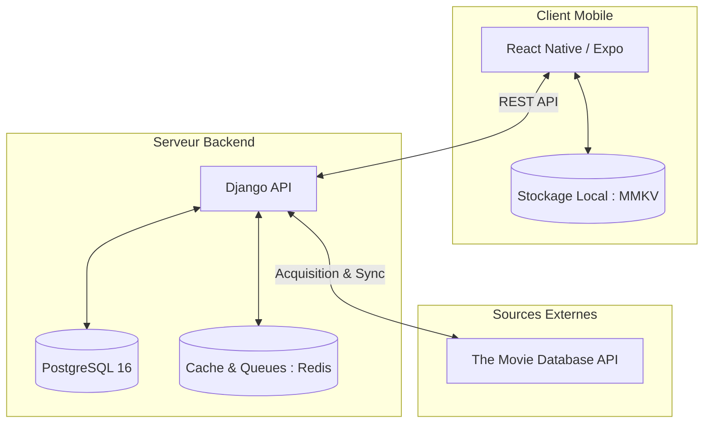

+++
date = '2026-06-21'
title = "L'architecture de Welshie"
summary = "Présentation des choix techniques derrière Welshie, une application mobile de recommandations de films et de séries entre amis."
tags = ["architecture", "django", "react-native", "expo", "docker"]
+++

Développer une application mobile moderne implique de faire des choix technologiques cohérents pour garantir la réactivité de l'interface, la robustesse du backend et la simplicité de l'infrastructure. 

Voici un tour d'horizon de l'architecture de **[Welshie](https://www.welshie.fr/)**, mon application de suivi de films et séries.

---

## Vue d'ensemble de l'architecture

L'application repose sur un découpage classique en trois couches : un client mobile natif, une API backend et une infrastructure conteneurisée.

---

## 1. Le Frontend : React Native, Expo & MMKV

Pour le client mobile, le choix s'est porté sur **React Native** avec **Expo (Bare Workflow)** en **TypeScript**.

### Pourquoi Expo Bare Workflow ?
* **Vitesse de développement** : Expo offre un environnement de développement incroyablement fluide (Hot Reloading, Expo CLI).
* **Accès aux modules natifs** : Le passage au *Bare Workflow* permet de générer des projets natifs iOS (`ios/`) et Android (`android/`) via `npx expo prebuild`. Cela offre la liberté d'ajouter des dépendances natives spécifiques sans être limité par le bac à sable d'Expo Go.

### Stockage Local Ultra-Rapide : MMKV
Plutôt que d'utiliser le traditionnel `AsyncStorage` (qui est asynchrone et peut ralentir l'interface sur de gros volumes de données), Welshie utilise **MMKV** via `react-native-mmkv`. 
* MMKV est une bibliothèque de stockage clé-valeur développée par Tencent, écrite en C++ et très performante.
* Les lectures et écritures sont synchrones et s'exécutent directement sur la mémoire partagée, ce qui évite les allers-retours sur le bridge asynchrone de React Native.

---

## 2. Le Backend : Django & Python 3.13

Le serveur d'API de Welshie est construit avec **Django** (Python 3.13) et géré via **Poetry** pour les dépendances.

### Pourquoi Django ?
* **ORM puissant** : Facilite la modélisation des relations complexes entre les films, séries, genres et plateformes de diffusion (*watch providers*).
* **Interface d'administration intégrée** : Permet de visualiser et d'éditer rapidement les données importées sans avoir à coder un panel d'administration dédié.
* **L'échosysteme** : Django comprend énormement de features built-in performantes, ce qui accélere la vitesse de développement et permet de ne pas perdre du temps a réinventer la roue.

---

## 3. L'Infrastructure : Docker, PostgreSQL & Redis

Toute l'infrastructure locale et de production est orchestrée avec **Docker Compose**, ce qui simplifie grandement le déploiement et la reproductibilité de l'environnement.

### PostgreSQL 16
Base de données relationnelle principale. Elle stocke les tables de données relatives aux utilisateurs, à leurs listes de lecture, ainsi que les centaines de milliers d'entrées de films et séries indexées.

### Redis
Utilisé à double titre :
1. **Cache** : Pour soulager PostgreSQL sur les requêtes fréquentes.
2. **File d'attente (Queue)** : Pour planifier et gérer les tâches asynchrones en arrière-plan.
