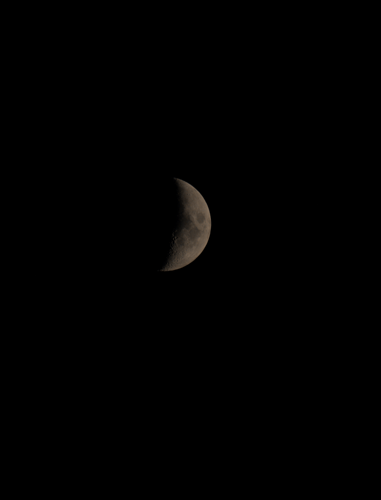

+++
date = '2026-06-20'
title = "La Lune du 19 Juin"
summary = "Astrophotographie de la Lune réalisée dans la nuit du 19 au 20 juin 2026."
tags = ["astrophotographie", "lune", "ciel-profond"]
+++

Une capture de la Lune réalisée durant la nuit du 19 au 20 juin 2026. 

### Matériel utilisé :
* **Monture** : *Sky-Watcher AZ GTO*
* **Télescope / Objectif** : Objectif Canon EF 75-300mm f/4-5.6 III
* **Caméra / APN** : Canon EOS 2000D

### Configuration & Acquisition :
* **Temps d'exposition** : 1/50 s
* **Sensibilité ISO** : ISO 400
* **Traitement** : Siril
