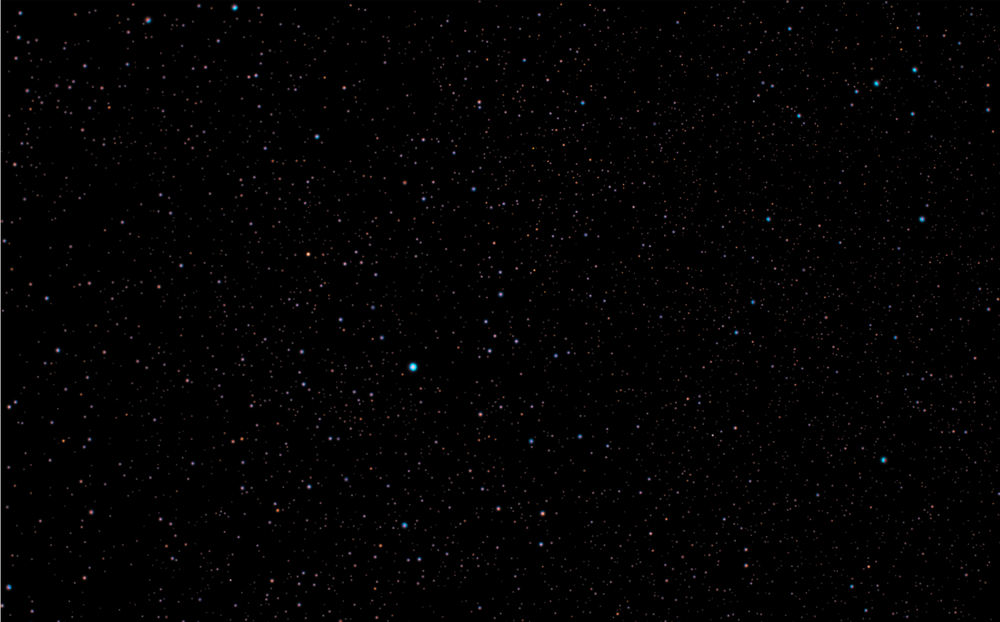

+++
date = '2026-07-05'
title = "Nébuleuse de l'haltere"
summary = "Astrophotographie de la Nébuleuse de l'Haltère (M27) réalisée dans la nuit du 05 au 06 Juillet 2026."
tags = ["astrophotographie", "nébuleuse", "ciel-profond"]
+++

Une capture de la la Nébuleuse de l'Haltère (M27) réalisée durant la nuit du 05 au 06 Juillet 2026. 

### Matériel utilisé :
* **Monture** : *Sky-Watcher AZ GTO*
* **Télescope / Objectif** : Objectif Canon EF 75-300mm f/4-5.6 III
* **Caméra / APN** : Canon EOS 2000D

Aucune lunette n'a été utilisé. Seulement un appareil photo simple.

### Configuration & Acquisition :
* **Temps d'exposition** : 25s par photo
* **Empilement** : 50 photos
* **Sensibilité ISO** : ISO 3200
* **Traitement** : Siril
