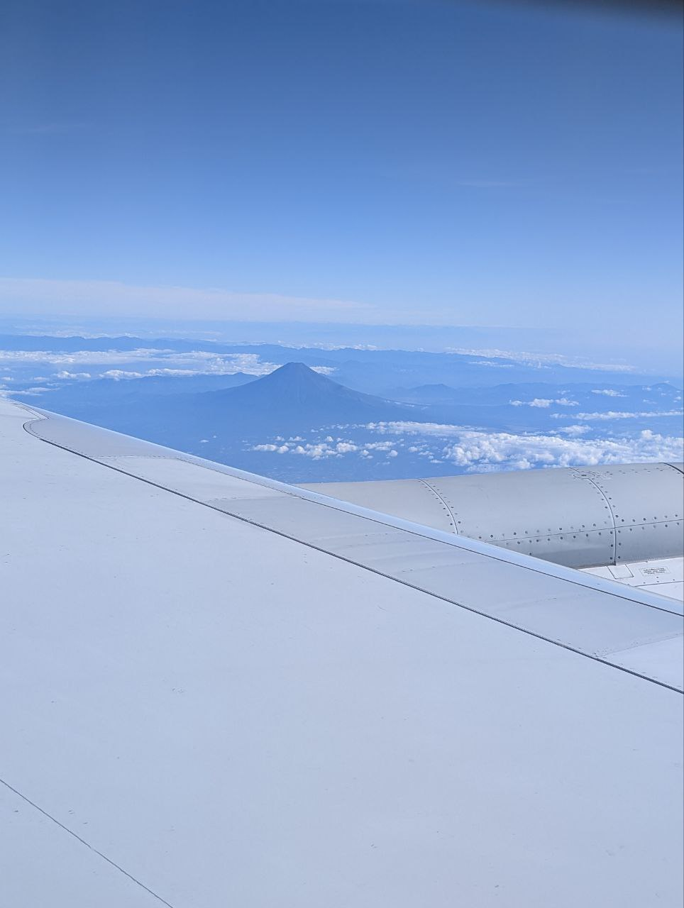
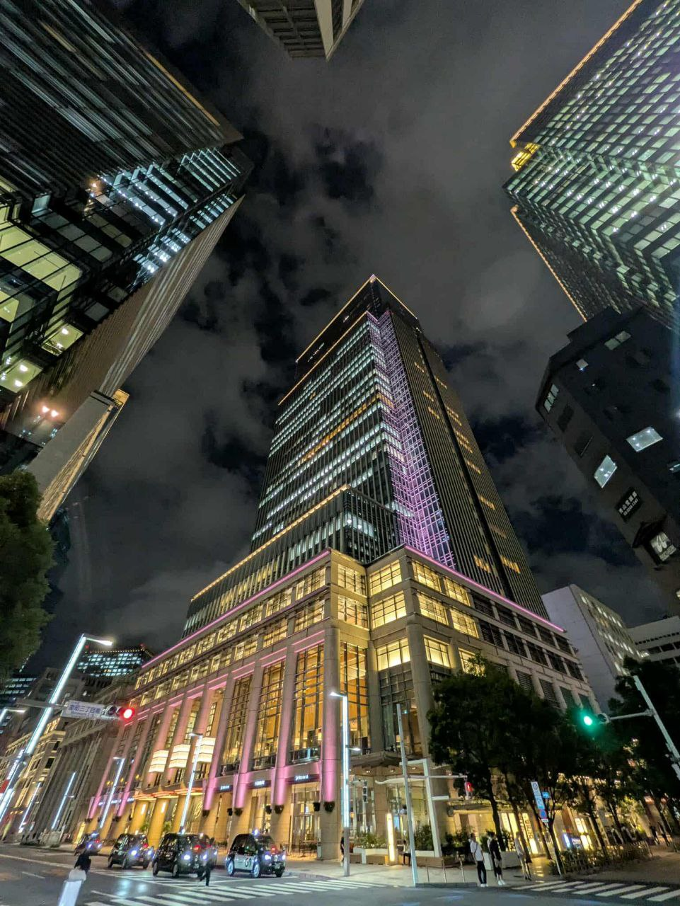
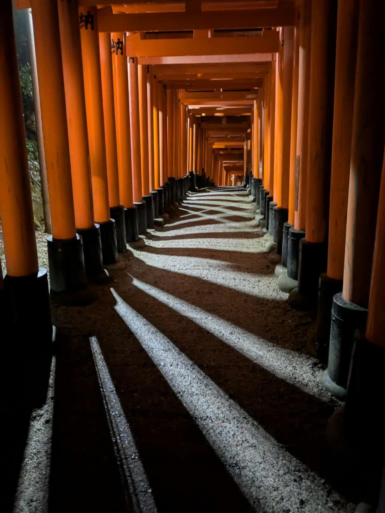
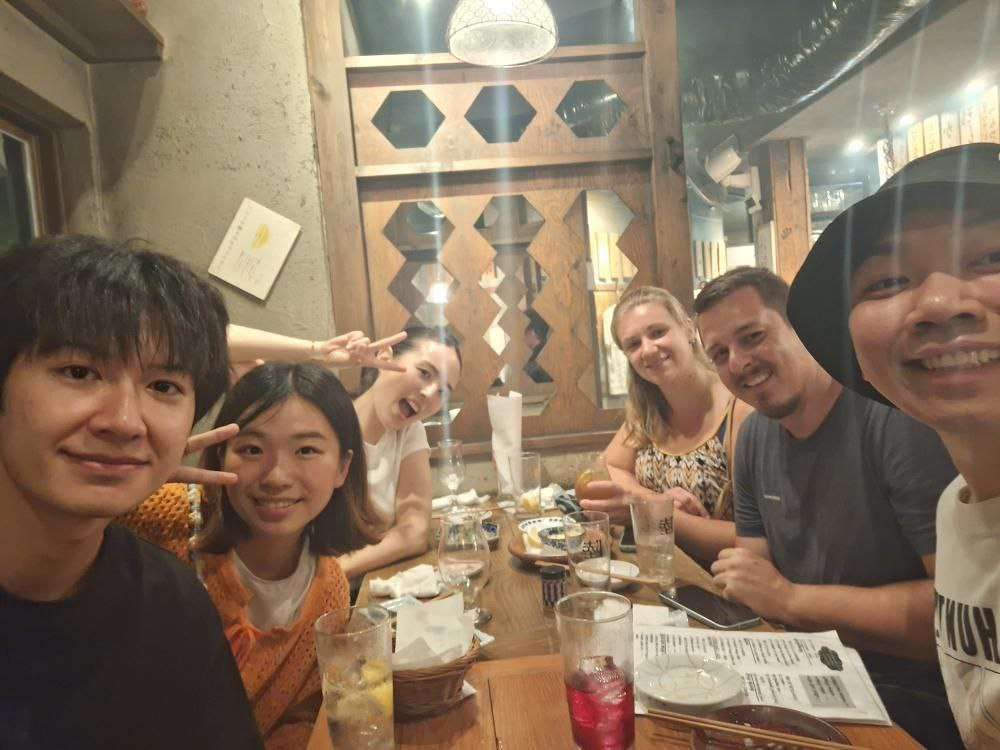
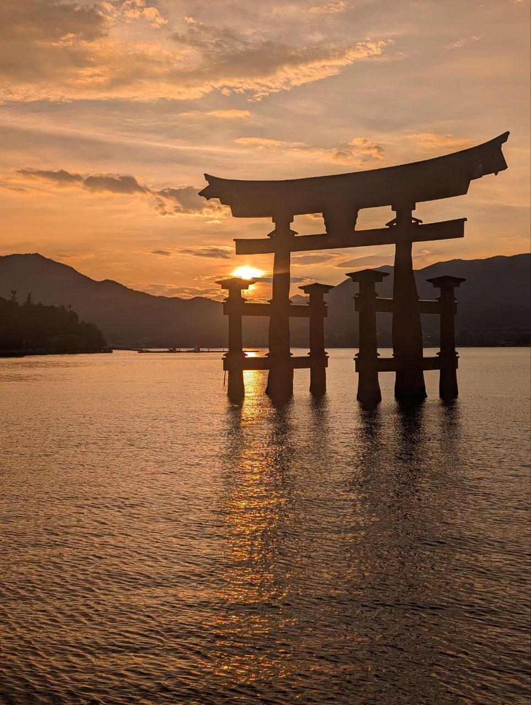
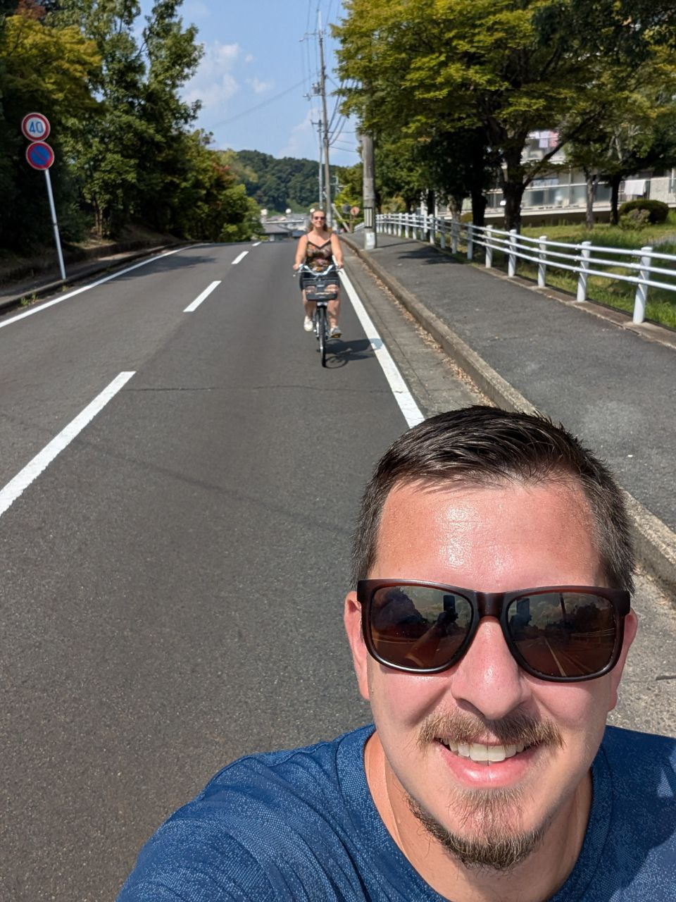
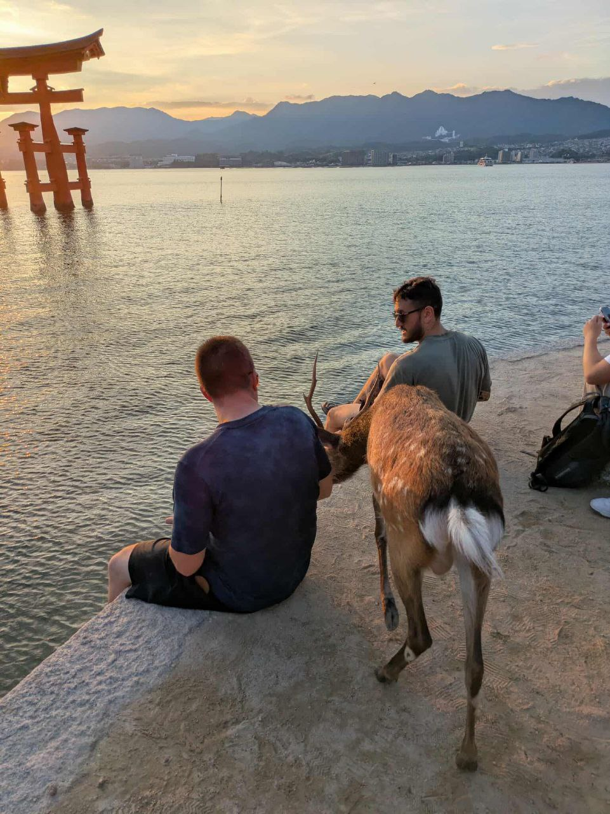

+++
date = '2025-09-26'
title = "Haïku de mon voyage au Japon"
summary = "Un cycle de 7 haïkus qui presente mon voyage au Japon de Septembre 2025"
readTime = true
autonumber = true
math = true
tags = ["haiku", "japon", "voyage"]
showTags = false
+++

Je suis parti au Japon avec ma copine pendant deux semaines en September 2025. C'était la deuxième fois cette année que je visitais ce pays. La première fois était en janvier avec 2 amis à Hokkaido.
J'ai decouvert les haïkus durant des sessions d'écriture avec [Stefan](https://stefanmiko.com/), un ami de longue date.  

Mon retour de ce second voyage était donc le bon moment pour poser sur papier mes sentiments par rapport à ce fabuleux pays et ce style convenait parfaitement. Voici donc un cycle qui symbolise l'ensemble de mon voyage, avec en dernier Haiku mes retrouvailles avec Saya.

###### 🎌 Notre arrivée au Japon

> L’aube se lève  
> Les cerisiers chuchotent  
> Je respire enfin

###### 🏙️ Tokyo

> Gratte-ciel qui s'élèvent  
> Fiers miroirs du ciel immense  
> Mes yeux chavirent  

###### ⛩️ Les Torii

> Torii vermillon  
> Au seuil des mondes anciens  
> Chasse les démons  

###### 🫂 Les retrouvailles

> Néons scintillants  
> Rires s'élèvent la nuit  
> Amis retrouvés  

###### 🏝️ Miyajima

> Lueur du couchant  
> Corps sur futons s'étirent  
> Rêves éveillés  

###### 🚲 Velo a Asuka

> Vent léger sur nous  
> Rizières défilent sous roues  
> Paix sur nos âmes  

###### ✈️ Le depart

> Regard au hublot  
> Temples et amis derrière  
> Vide dans le coeur  

##### Saya
  
> Au soleil couché  
> Sa toison d'or apparait  
> Douceur retrouvée  

